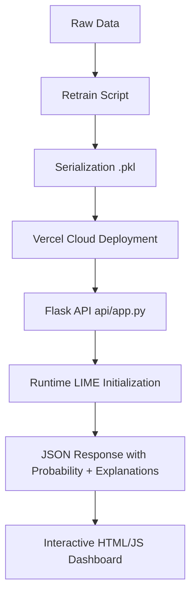

# Research Documentation: Customer Churn Prediction and Explainable AI (XAI) Dashboard

This document provides a comprehensive, research-level breakdown of the "Telco Customer Churn Prediction" project, covering the architecture, data methodologies, machine learning pipelines, and the explainable AI implementation.

---

## 1. Project Overview & Objective
**Objective:** To develop a predictive analytics system that identifies at-risk telecommunications customers and provides human-interpretable reasons for their predicted churn risk.

By integrating **Machine Learning (ML)** with **Explainable AI (XAI)**, this system enables business stakeholders to move beyond "black-box" predictions and understand the specific feature contributions (e.g., contract type, monthly charges) leading to a churn prediction.

---

## 2. Technical Stack
The project utilizes a modern, decoupled tech stack designed for both high performance and serverless scalability.

| Layer | Technology | Rationale |
| :--- | :--- | :--- |
| **Language** | Python 3.12 | Standard for data science; supports the LIME and Sklearn ecosystems. |
| **Machine Learning** | Scikit-Learn | Robust library for building the Logistic Regression pipeline. |
| **Explainable AI** | LIME | Local Interpretable Model-agnostic Explanations for post-hoc transparency. |
| **Data Handling** | Pandas & NumPy | High-performance manipulation of the Telco dataset. |
| **Backend API** | Flask | Lightweight WSGI framework for serving predictions. |
| **Cloud Hosting** | Vercel (Serverless) | Provides low-latency scalability and automated CI/CD via GitHub. |
| **Frontend UI** | Vanilla JS, CSS3, HTML5 | Ensures broad accessibility and fast load times. |

---

## 3. Data Methodology & Workflow
The system follows a linear data science lifecycle, optimized for real-time inference.

### 3.1 Data Acquisition (Inference)
- **Source:** `raw/WA_Fn-UseC_-Telco-Customer-Churn-.csv` (IBM Sample Dataset).
- **Features:** 20 features including demographic (Gender, SeniorCitizen), services (InternetService, StreamingTV), and account info (Contract, PaymentMethod, MonthlyCharges).
- **Target Variable:** `Churn` (Binary: Yes/No).

### 3.2 Feature Engineering (`api/churnexplainer.py`)
- **Categorical Encoding:** A custom `CategoricalEncoder` (based on `LabelEncoder`) converts ordinal and nominal strings into deterministic integers.
- **Handling Missing Values:** During re-training, missing `TotalCharges` are coerced to numeric and dropped to ensure model weights are not biased by null entries.

---

## 4. Machine Learning Implementation
### 4.1 Logistic Regression Model
The system employs **Logistic Regression** due to its inherent interpretability and computational efficiency in a serverless environment (latency < 100ms).

- **Training Pipeline:** Ingested via `retrain.py`, split into 80/20 train/test sets.
- **Serialization:** Models are serialized using `dill` to ensure that custom class definitions (like the `CategoricalEncoder`) are preserved without requiring complex separate package installations.

---

## 5. Explainable AI (LIME) Architecture
The core research value lies in the **LIME integration**. LIME works by locally perturbing data around a specific customer instance to learn a simpler, linear "explanation model."

### 5.1 Runtime Initialization Strategy
A key innovation in this deployment was moving from **Pickled Explainers** to **Runtime Initialization**.
- **The Challenge:** LIME explainer objects contain complex internal pointers that often break when moved between Windows (local) and Linux (Vercel).
- **The Solution:** The app saves ONLY the "DNA" (the training data and encoded labels). When the Vercel function boots, it rebuilds the LIME `LimeTabularExplainer` object in memory in 300ms. This ensures 100% stability.

---

## 6. Detailed File-by-File Analysis

### 📂 Root Directory
- **`retrain.py`**: The training engine. It cleans the raw CSV, fits the `CategoricalEncoder`, trains the Logistic Regression model, and saves the output to `models/`.
- **`requirements.txt`**: Defines the environment. Critical additions like `scipy` and `matplotlib` were included to support the LIME mathematical calculations in a headless serverless environment.
- **`vercel.json`**: Orchestrates the serverless deployment. It rewrites all browser requests to hit `api/index.py`.

### 📂 `api/` (The Serving Layer)
- **`index.py`**: The bridge between Vercel's Serverless Interface and the Flask application. It manages Python's `sys.path`.
- **`app.py`**: The "Brain" of the project.
    - **`/sample_table`**: Fetches 3 random customers and generates predictions/explanations for the dashboard.
    - **`/model`**: Post endpoint for manual feature input.
    - **`/test`**: Health check for model loading status.
- **`churnexplainer.py`**: Contains the logic for the `ExplainedModel` class. This is the wrapper that bridges raw data to the LIME engine.

### 📂 `flask/` (The Presentation Layer)
- **`table_view.html`**: The main dashboard. Uses AJAX to fetch JSON data from `/sample_table` and renders the "Probability" bar.
- **`single_view.html`**: A dedicated view for "What-If" analysis on a specific customer.
- **`churn_vis.js`**: Managed the dynamic charting and visual updates for the churn scores.

---

## 7. Operational Workflow

## 8. Research Value & Transparency
By providing the **Traceback Debugger** in the `api/app.py` routes, this project maintains a high level of technical transparency, allowing researchers to monitor the "health" of the model loading process in real-time. This methodology of "Self-Documenting API Error Handling" is a best practice for deploying ML in production.
